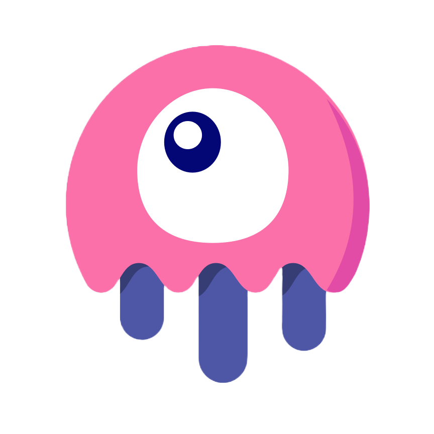
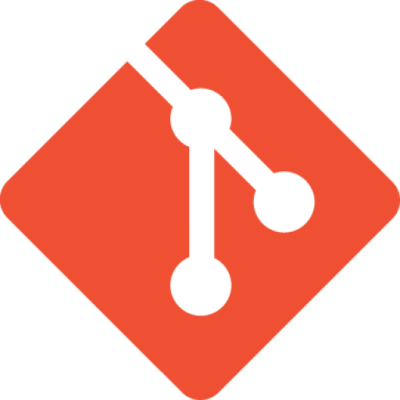
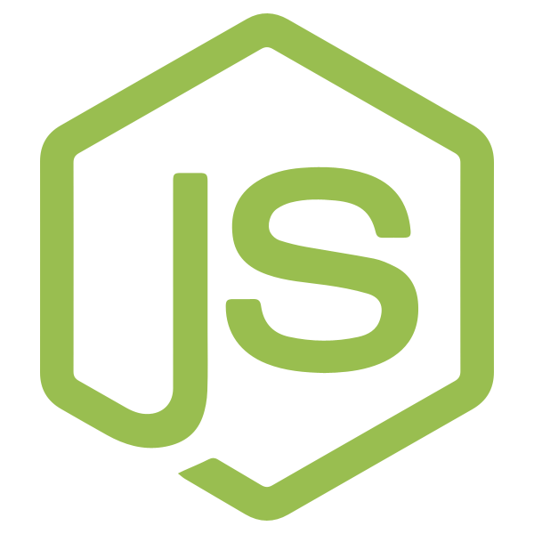

    

        <h1>Hi! I'm Tomhuel</h1>
    

    <!--<h2>About Me</h2>-->
    

    👨‍💻 Como desarrollador web Full Stack Junior estoy listo y motivado para comenzar a aplicar profesionalmente mis conocimientos 💪💪
     
     
    Con proactividad, actitud positiva, disciplina, organización y trabajo en equipo 🤝, me enfrento a los retos con ganas e ilusión, procurando obtener los mejores resultados posibles 🙌
     
     
    La curiosidad y el gusto por lo innovador me impulsan a mantenerme en constante formación y aprendizaje 🔎
     
     
     
    👨‍💻 As a Junior Full Stack web developer, I am ready and motivated to start applying my knowledge professionally 💪💪
     
     
    With proactivity, a positive attitude, discipline, organization, and teamwork 🤝, I face challenges with enthusiasm and excitement, striving to achieve the best possible results 🙌
     
     
    Curiosity and a love for innovation drive me to constantly seek further education and learning 🔎
    

     
    <h2>Technologies</h2>
    <h3 style="text-align: center;">Languages</h3>
    

    

        
        
        
        
        
        
        
    

     
    <h3 style="text-align: center;">Frameworks & Libraries</h3>
    

    

        
        
        
        
        
        
    

     
    <h3 style="text-align: center;">Others</h3>
    

    

        
        
        
        
        
    

     
    <h2>Let's get in touch!</h2>
    

    

        

            <a href="https://www.linkedin.com/in/tom%C3%A1s-nahuel-antela-rizzo-729149258/" style="display: flex; align-items: center; gap: 5px; flex-direction: column">
                
                
Tomás Nahuel Antela Rizzo

            </a>
            <a href="./assets/cv/CV Español.pdf" style="display: flex; align-items: center; gap: 5px; flex-direction: column">
                
                
CV Español

            </a>
            <a href="./assets/cv/CV English.pdf" style="display: flex; align-items: center; gap: 5px; flex-direction: column">
                
                
English CV

            </a>
        

    

