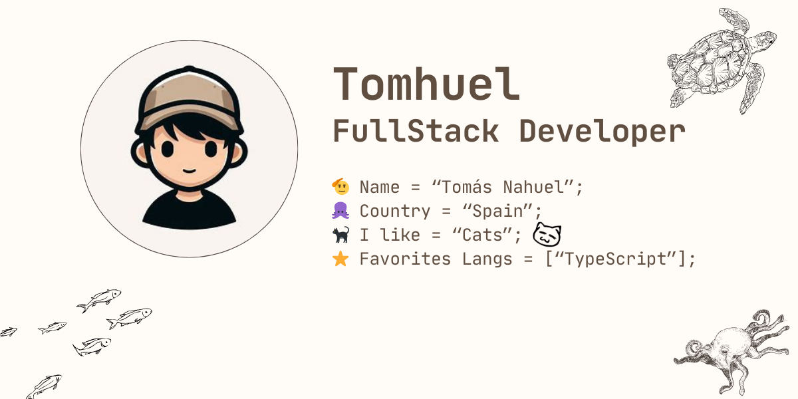

    

        
    

     
    <h2>About Me</h2>
    As a Junior Full Stack web developer, I am ready and motivated to start applying my knowledge professionally.
     
     
    With proactivity, a positive attitude, discipline, organization, and teamwork, I face challenges with enthusiasm and excitement, striving to achieve the best possible results.
     
     
    Curiosity and a love for innovation drive me to constantly seek further education and learning.
    

     
    <h2>🎨 Stats</h2>
    

        
    

    

        
    

    <h2>💻 Technologies</h2>
    

        
        
        
        
        
        
        
        
        
        
        
        
        
        
        
        
        
        
        
        
        
        
    

